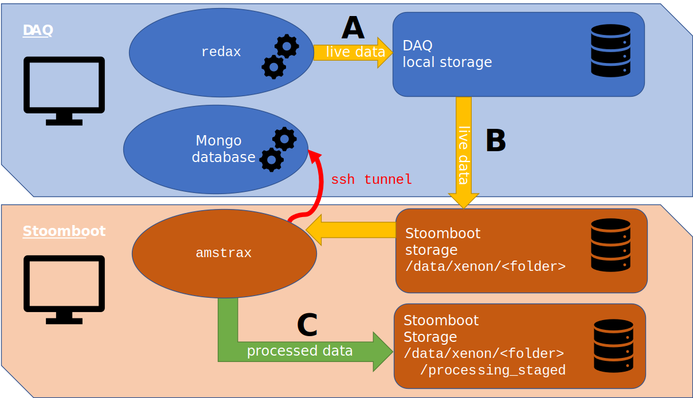

# Auto processing on stoomboot

This document describes the dataflow for XAMS and XAMSL data.

## DAQ - `redax`

Important to note is that the data is collected with [`redax`](https://github.com/XAMS-nikhef/redax)
.
`redax` runs on the "DAQ-machine". We assume that this collection of data is fully seperated from
the processing (as it should be). Additionally, the DAQ host also hosts the `mongo database`. This
is where we store information about the runs.

## Workflow

Below we added a diagram of how the dataflow is organized. The data is read from the digitizers by
redax which writes it to some local storage (`A`). From that local storage, one has to transfer this
data to stoomboot, e.g. using `rsync` (step `B`)
to some `<folder>` on `/data/xenon`. This folder may depend on which

As soon as the data is on stoomboot, one can auto process the data (more details below). To know
which runs there are, we need to have `ssh tunnel` to the DAQ-host. We described the requirements
for the ssh tunneling in the setup of this documentation.


### Required user input

Right now, we did not automize step `B`. E.g. one can run this command to transfer a single run:

```bash
rsync -a -e ssh xams:/media/xams/Elements/xams/000932 /data/xenon/xamsl/live_data/.
```

You will notice that `<folder>` in the diagram above is `xamsl/live_data` in this example.

## Processing on stoomboot (`C`)

To process the data from `xamsl/live_data` for a single run, one would have to do:

```bash
cd <amstrax_installation_folder>/amstrax/auto_processing
python amstraxer.py <run_id> --target raw_records_v1730 # Use --help to get more info
```

Now, we'd like to do this a bit more automated and running on stoomboot, to this end do:

```bash
cd <amstrax_installation_folder>/amstrax/auto_processing
python submit_stbc.py <run_id> --target raw_records_v1730 # Use --help to get more info
```

### Automated submits

Now the real magic happens if you want to process all of it. To this end set in the rundoc

```python
{'processing_status': 'pending'}
```

for all the runs you would want to process. Now, we can start making the data using:

```bash
cd <amstrax_installation_folder>/amstrax/auto_processing
python auto_processing.py --target desired_target
```

This will automatically submit jobs for where the processing status is `'pending'` for. It will
update the runs-collection `'processing_status'` (also if it fails) so you can easily monitor the
progress.

### Automated submits - advanced

Let's assume all the above seemed trivial, let's go one step further.

First, let's automate step `A` by automatically transferring data as soon as it finished processing
on the DAQ to stoomboot after which you will set the
`'processing_status'` to `'pending'` for this run.

Next open a screen (on stoomboot): `screen -S auto_process` and do

```bash
cd <amstrax_installation_folder>/amstrax/auto_processing
python submit_stbc.py <run_id> --target raw_records_v1730 # Use --help to get more info
```

exit the screen and enjoy data being automatically being processed for you. Keep in mind to not
change the `'processing_status'` anymore, we will do a lot of useless jobs otherwise.